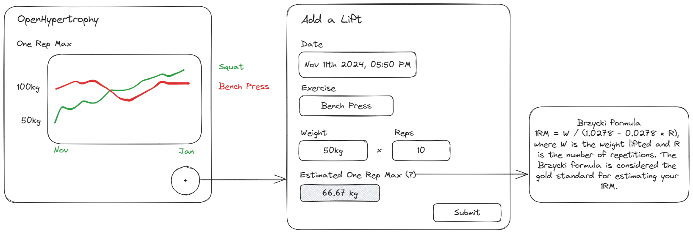

# open-hypertrophy

An open-source web-based strength tracker for hypertrophy

Note: This project is under construction.

## Demo

- Link: https://hypertrophy.sandbox.com.np
- Username: `demo`
- Password: `demo`

## Concept



## Run Locally using Docker

1. Download `docker-compose.yml`.
1. Start the server.
   ```
   docker compose up
   ```
1. The server should be running in http://127.0.0.1:8000/.

1. Create a user to access the web application.
   ```
   docker compose exec python manage.py createsuperuser
   ```

## License

This project is licensed under the terms of the MIT license.
